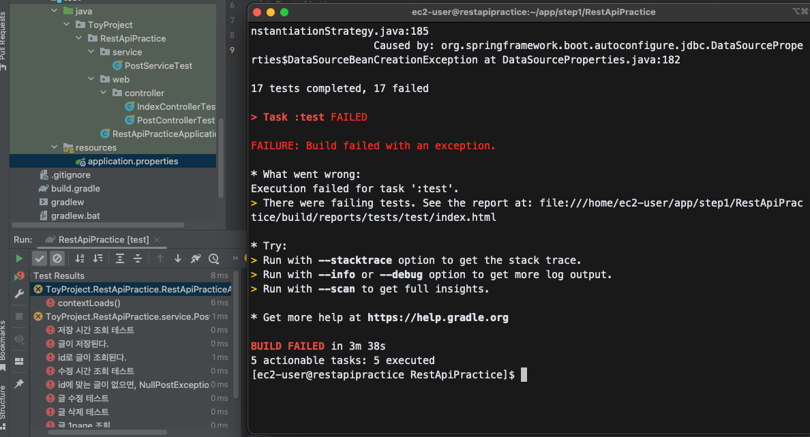
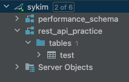
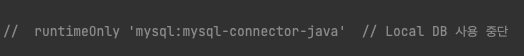
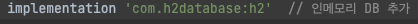
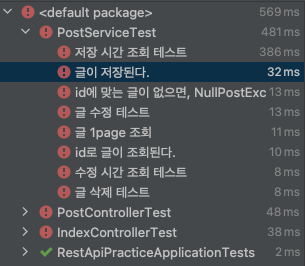
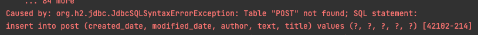
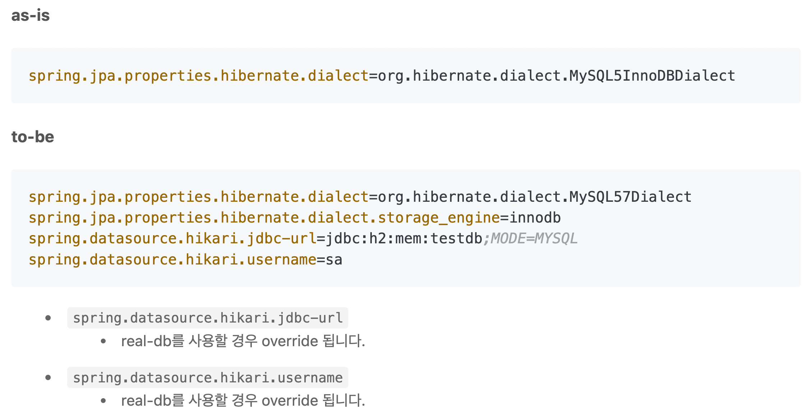
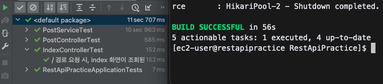

# RestApiPractice

지금까지 공부한 REST API 지식을 토대로, 혼자 구현해보는 연습을 한 리포지토리입니다.

추가로, **스프링 부트와 AWS로 혼자 구현하는 웹서비스** 도서의 내용을 응용하였습니다.

## 문제 해결
1. TEXT/HTML type test (test: controller/indexController)
    - 문제 발생 상황
      - "/" get 요청 -> index.html 조회
      - 위의 TEXT_HTML 타입의 응답을 mockMvc로 테스트하고자 함
      - HTML 파일의 body 부에 "스프링 부트로 시작하는 웹 서비스"라는 문자열이 포함되어있는지 검증 로직 작성
        ```       
        mockMvc.perform(MockMvcRequestBuilders.get("/")
                .contentType(MediaType.TEXT_HTML))
                .andExpect(status().isOk())
                .andExpect(content().string(containsString("스프링 부트로 시작하는 웹 서비스")))
                .andDo(print());
        ```
    - 발생한 문제
      - HTML 파일 상의 모든 한글이 ???로 표기되는 문제 발생
      - mockMvc의 encoding이 UTF-8로 설정되어있지 않다고 판단.
      - 문제 해결을 위해 구글링 후 아래와 같이 설정하여 해결
      ```    
      @Autowired
      private WebApplicationContext ctx;
      
      @BeforeEach
      public void setup() {
          this.mockMvc = MockMvcBuilders.webAppContextSetup(ctx)
          .addFilters(new CharacterEncodingFilter("UTF-8", true))  // 필터 추가
          .alwaysDo(print())
          .build();
      }
      ```
2. mustache 화면 출력 시, 한글 깨짐 현상
   - application.yaml 파일에 아래의 설정정보를 추가하여 해결
   ```
   server:
       servlet:
           encoding:
               force-response: true
   ```
   
3. WebSecurityConfigurerAdapter -> deprecated
   - 책 내에서 사용하던 WebSecurityConfigurerAdapter가 deprecated되어 현재 버전에서는 지원되지 않음.
   - 원래는 해당 어댑터를 상속받아 설정을 오버라이딩 하는 방식이었음.
   - 변경 후, 상속받지 않고 모두 Bean으로 등록하는 방식으로 변경 됨
   - 아래와 같이 설정 코드를 변경하여 해결
   ```    
   @Bean
    public SecurityFilterChain filterChain(HttpSecurity http) throws Exception {
        http
                .csrf().disable()
                .headers().frameOptions().disable()
                .and()
                .authorizeHttpRequests()
                .antMatchers("/", "/css/**", "/images/**", "/js/**", "/h2-console/**", "/profile").permitAll()
                .antMatchers("/api/v1/**").hasRole(Role.USER.name())
                .anyRequest().authenticated()
                .and()
                .logout()
                .logoutSuccessUrl("/")
                .and()
                .oauth2Login()
                .userInfoEndpoint()
                .userService(customOAuth2UserService);

        return http.build();
    }
   ```
   
4. 세션 - DB 연동 시, Table이 생성되지 않는 문제
   - 책에서는 H2 database를 사용하였으나, 나는 Mysql을 사용하였다.
   - spring.session.store-type=jdbc로 설정하였었으나, 테이블이 생성되지 않아 오류 페이지가 뜨는 문제가 발생함.
   - Mysql 사용 시, 아래의 정보를 추가적으로 기입해주어야 한다. 
     - initialize-schema : 기본 값이 `embedded`이기 때문에, embedded DB가 아니라면 아래 두개의 세션 관련 테이블이 자동 생성되지 않는다.
       - SPRING_SESSION, SPRING_SESSION_ATTRIBUTES
   - [참고 1. spring.session.jdbc.initialize-schema 옵션](https://smpark1020.tistory.com/212)
   - [참고 2. Spring Session with JDBC](https://www.javadevjournal.com/spring/spring-session-with-jdbc/)
   ```  
   session:
       jdbc:
           initialize-schema: always  //always - 자동 테이블 생성 || never - 수동으로 세션 테이블 생성
           table-name: SPRING_SESSION
       store-type: jdbc
   ```

---
저에게 조금 크게 다가왔던 문제이었기에 따로 정리하였습니다.
### Local DB로 사용하던 MySQL -> AWS maria DB로 변경 후 전부 실패
   
   #### 발생한 문제 사항

   - 테스트 실패
   - 빌드 실패

   애초에 AWS maria DB로 연동만 성공시켜 놓고, 테스트를 하지 않은 내 불찰이다.
   문제가 터졌으니 기쁜 마음으로 해결해보자!

   #### #1 : DB 연동이 안된 것 같다.

   - Local MySQL을 사용하면 테스트가 모두 성공한다.
     - Intellij에서 Maria DB를 설정하면 테스트가 모두 실패한다.
        - 일단 Maria DB는 DB만 생성해놓은 것일 뿐, java 프로젝트에 연결된 상태는 아니다. MySQL을 쓰듯이 그냥 intellij에 연결만 하면 되는구나! 하고 착각하고 있던 것이다. 설정 방식은 DB마다 다른데,  프로젝트의 application.yml에 등록해줘야 하는 점은 동일하다.

            ```yaml
            spring:
              datasource:
                driver-class-name: com.mysql.cj.jdbc.Driver
                username: kim
                password: ~~~
                url: jdbc:mysql://localhost:3306/restApiPractice?serverTimezone=UTC&characterEncoding=UTF-8
            ```

           - 위와 같이 MySQL을 설정해주듯이, MariaDB도 설정해줘야 한다는 것을 간과한 것이다..!
        - 그저 Intellij에서는, 콘솔보다는 DB를 잘 볼 수 있게, 이쁘게 만들어 준 것이다^^…
        - 책 뒷 부분에서 Maria DB를 프로젝트에 연결시키니, 그 부분을 자세히 보자.
          
   
   두시간은 삽질을 한 것 같다. 하지만 얻는게 있었다! 좋은 삽질이었다…^^!
      
  - 책에서 보고 따라한 위의 행위는 ”DB를 콘솔창보다 보기 이쁘게 만들어주는 행위”이다.
  - 우리가 로컬 DB를 프로젝트에 연결하듯, AWS 배포에 사용할 RDS MariaDB도 프로젝트에 등록해줘야 한다. (책 뒷부분에 나온다.)
   
   
   #### #2 : 그래도 테스트는 성공시켜야 제맛이지.

   테스트는 반드시 성공시키고 넘어가고 싶다는 생각에, 인메모리 DB를 사용하기로 했다. 책에서는 사용을 하셨지만, 나는 MySQL을 사용해보고 싶다는 생각에 다른 루트를 탄게 화근이 되었던 것 같다.

  - 제일 먼저, 애용했던 MySQL을 보내주었다.
    
  - 그리고 인메모리 DB를 사용하기 위한 Dependency를 추가하였다.
    
  - 기쁜 마음으로 전체 테스트를 돌렸다. 
  - 성공!!!!!!!!!!
  - ㅎ…ㅏ지않았다.
    
      

무수히 찍히는 느낌표는 롤에서만 만나는줄 알았는데………

자 그래도 원인을 파악해보도록 하자.

내가 좋아하는 영한쌤의 어록이 있는데, “가장 근본적인 에러는 아래에 있다.”는 말이다.

맨아래로 ㄱㄱ




ㅋㅋ Table이 없댄다. 왜 없지? 하고 무수히 많은 글을 돌아다니다, 가장 근본적으로 해결한 글을 찾았다.

[(2020.12.16) 스프링 부트와 AWS로 혼자 구현하는 웹 서비스 최신 코드로 변경하기](https://jojoldu.tistory.com/539)

애프터 서비스까지 해주시는 친절함…….

위 글을 보면 내가 직면한 문제를 짚어서 설명을 해주신다.

`create table` 쿼리가 H2 에서 정상적으로 수행이 안되었기 때문이라고 한다. 정상 수행이 안된 이유는 다음과 같다.

- Spring Boot 2.1.10 버전 부터, MySQL의 문법 지정 방식에 변화가 있었다.
   - 그래서, DB 설정들의 변경이 필요하다!
   - 향로 센세의 말씀대로, application.yaml(`src/resources`)과 application.properties(`test/resources`)의 구문을 다음과 같이 수정해주었다.


   - 위와 같이 설정한 후, 말끔히 테스트가 해결되었다!
     